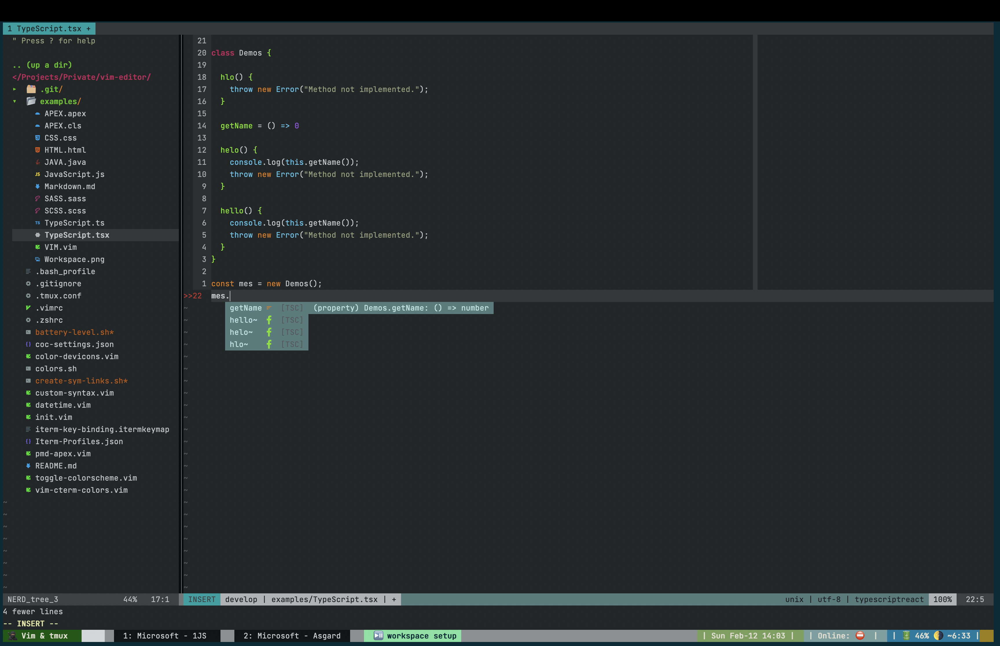

```
db       .d88b.  db    db d88888b   db    db d888888b .88b  d88.      d888888b .88b  d88. db    db db    db
88      .8P  Y8. 88    88 88'       88    88   `88'   88'YbdP`88      `~~88~~' 88'YbdP`88 88    88 `8b  d8'
88      88    88 Y8    8P 88ooooo   Y8    8P    88    88  88  88         88    88  88  88 88    88  `8bd8'
88      88    88 `8b  d8' 88~~~~~   `8b  d8'    88    88  88  88         88    88  88  88 88    88  .dPYb.
88booo. `8b  d8'  `8bd8'  88.        `8bd8'    .88.   88  88  88 db      88    88  88  88 88b  d88 .8P  Y8.
Y88888P  `Y88P'     YP    Y88888P      YP    Y888888P YP  YP  YP V8      YP    YP  YP  YP ~Y8888P' YP    YP
P

.d888b.     d88888b d88888D d88888b
8P   8D     88'     YP  d8' 88'
`Vb d8'     88ooo      d8'  88ooo
 d88C dD    88~~~     d8'   88~~~
C8' d8D     88       d8' db 88
`888P Yb    YP      d88888P YP
```

♠️ ♤ Keep rocking 🎸 my text editing experiece 💙💚💜

## Getting started

NB: A lot of set up here has been done in NeoVim environment. While it's expected to work similarly in Vim >= 8, I highly
recommended setting it up in NeoVim. The feel is expected to be similar, though.

### Install the necessary stuff

- Make sure that you have installed the following(_Using Homebrew recommended_):
  - Vim > 8.\* or NeoVim
  - [vim Plug](https://github.com/junegunn/vim-plug) - for (Neo)vim plugins
  - tmux
    - and [Tmux Plugin Manager](https://github.com/tmux-plugins/tpm)
  - [oh-my-zsh](https://ohmyz.sh/) - manage your zsh configuration and add themes and plugins
  - [FZF](https://github.com/junegunn/fzf) - an amazing commandline fuzzy finder for your files a lot of things 🤓. Check it out!!
  - [ripgrep](https://github.com/BurntSushi/ripgrep) - find files by content(grep) from files. Integrates with FZF to work inside Vim/NeoVim
  - [grip](https://github.com/joeyespo/grip) - (_to enable Markdown Preview for_)
  - pmd - static code analyzer. Please use brew or apt to install this.

### Add symbolic links for necessary files

In the root directory for this repo, run `zsh ./create-sym-links.sh`. Ignore missing directory for ale linters pmd; it should be created once vim plugins have been installed.

This will help to make sure that set up and configuration files such as:

- .vimrc
- .zshrc
- .tmux.conf
- [coc.nvim](https://github.com/neoclide/coc.nvim) configuration file

### Add vim plugins

Run `:PlugInstall` inside (Neo)vim. Or shortcut `<leader>I`

### Add required coc-plugins

`CocInstall coc-fzf-preview`

### Useful mappings

#### Normal mode

- `<C-F>f` - Searches git files with `:CocCommand fzf-preview.GitFiles`
- `<C-F>c` - Searches git branches with `:CocCommand fzf-preview.GitBranches`
- `<C-F>b` - Searches recently opened buffers
- `<Space>c` - Searches Coc.nvim commands with `:CocCommand`
- `gd` - Go to Definition
- `gi` - Go to Implementation
- `gr` - Go to References
- `j` - Cursor down a line
- `k` - Cursor up a line
- `gq` - Quit current buffer
- `<C-T>o` - Quit all tabs except current
- `<C-W>o` - Quit all window in current tab except current window

### Setting up terminal devicons

This will enable Vim/NeoVim to display nerd icons e.g. File Extension icons on NERDTree etc.

- Download and install a [patched Nerd Font](https://github.com/ryanoasis/nerd-fonts)
  - such as [Hack Nerd Font](https://github.com/ryanoasis/nerd-fonts/releases/download/v2.1.0/Hack.zip)
  - ensure that the font installed has nerd devicons - You can use Font Book if using MacOS to check out the installed font
- Open you terminal emulator e.g. ITerm and set the Font Type to the patched font

### Setting up italic text in iTerm2

Follow the instructions
https://weibeld.net/terminals-and-shells/italics.html

## Setting up coc.nvim language servers

#### Salesforce APEX linting with PMD

We can use PMD with ALE plugin to provdie Salesforce's APEX linting abilities.

- Ensure you have installed PMD with brew. `brew install pmd`
- Once you have installed your plugins and you have ALE installed, create a symbolic link from the `./pmd-apex.vim` file to `~/.vim/plugged/ale/ale_linters/apexcode/pmd.vim`
  - `ln -s $(pwd)/pmd-apex.vim ~/.vim/plugged/ale/ale_linters/apexcode/pmd.vim`

### Common language servers

- Coc.nvim has a lot of plugins for providing language intellisense for many common languages and frameworks. Just do a google search for your favourite language. e.g.

  - `coc-tsserver` - for TypeScript and JavaScript
  - `coc-python` - for ...
  - `coc-angular` - for ...

  - etc



```
.oPYo.                    8     o                         88 88 88
8    8                    8     8                         88 88 88
8      .oPYo. .oPYo. .oPYo8    o8P .oPYo.   .oPYo. .oPYo. 88 88 88
8   oo 8    8 8    8 8    8     8  8    8   8    8 8    8 88 88 88
8    8 8    8 8    8 8    8     8  8    8   8    8 8    8 `' `' `'
`YooP8 `YooP' `YooP' `YooP'     8  `YooP'   `YooP8 `YooP' 88 88 88
:....8 :.....::.....::.....:::::..::.....::::....8 :.....:.........
:::::8 :::::::::::::::::::::::::::::::::::::::ooP'.::::::::::::::::
:::::..:::::::::::::::::::::::::::::::::::::::...::::::::::::::::::

```
